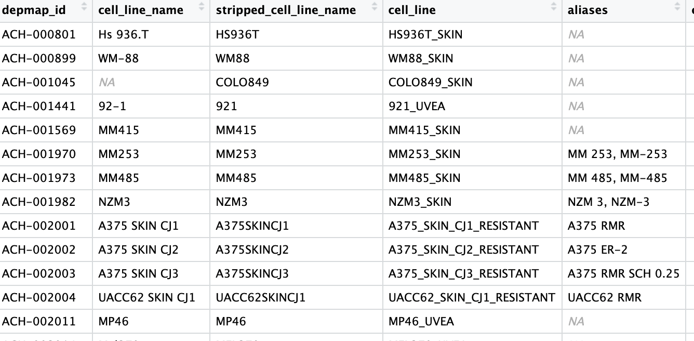

# discordant-transcript-attempt

## Progress/Notes
- So far, I've gotten cell-line data with melanoma

- Next, I need to get transcript expression data for these cells (e.g figure out which transcripts were being expressed), and MITF expression data (whether MITF expression was high/medium/low)
- Once I figure out that, that will give us targets for isoforms we will see if MITF knockout will affect
